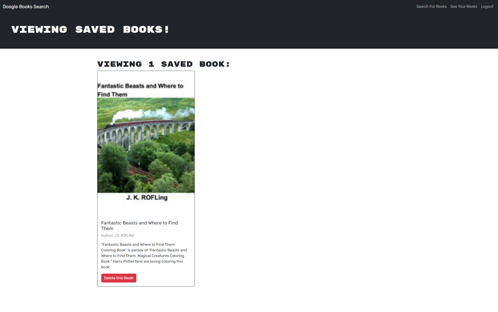

# Book-Search-Engine

Search your favorite book titles using Google's API combined with back-end GraphQL API's.

## Description
* Refractor code to work with GraphQL and ApolloServer.
* Created using babel for older browser supports and webpack builder plugins.
* Uses MERN for application for a full stack experience.

## Table of Contents
- [Installation](#installation)
- [Usage](#usage)

- [Screenshot/Video](#screenshotvideo)
- [Deployed APP](#deployed-application)
- [Contributing](#contributing)
- [License](#license)
- [Questions](#questions)

## Installation
* _Run installation_:
> npm install

* _Run in terminal_:
> npm run build

* _Run in terminal_:
> npm run develop

## Usage
Usage of this application is develop a fullstack MERN application with a third-party API that functions on ApolloServer and GraphQL for back-end API's. Users can search for their favorite book titles and save the current book to their profile. Users are able to create a login and logout as necessary.

## Screenshot/Video

## Deployed Application
*A list of links of deployed applications:*

- [DeployedAPP](https://googlebook-search-engine-b907f5a9f918.herokuapp.com/)

## Contributing
*A list of contributors on this project includes:*

* [Sith Hun](#github)

*Third-party applications used to create this project:*
* [Webpack](#webpack)
* [Babel](#babel)
* [React](#react)
* [ApolloServer](#apolloserver)
* [GraphQL](#graphql)
* [Express.JS](#expressjs)
* [Node.JS](#nodejs)

## License
*This project is licensed under the MIT.*

## Questions
If you have any questions, you can reach out to me via GitHub: [@SithHun](https://github.com/SithHun)

Feel free to contact me via email: sithsun@gmail.com

 

> *Credits: This ReadMe was created with ❤️ by [Professional-ReadMe-Generator](https://github.com/SithHun/Professional-ReadMe-Generator)*
